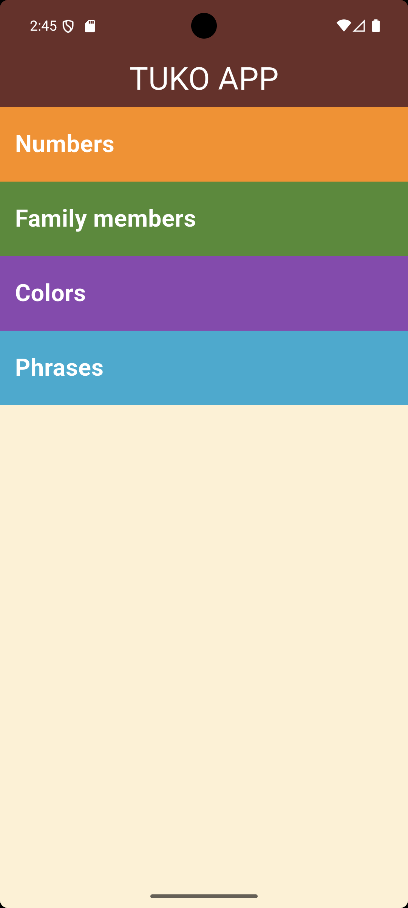
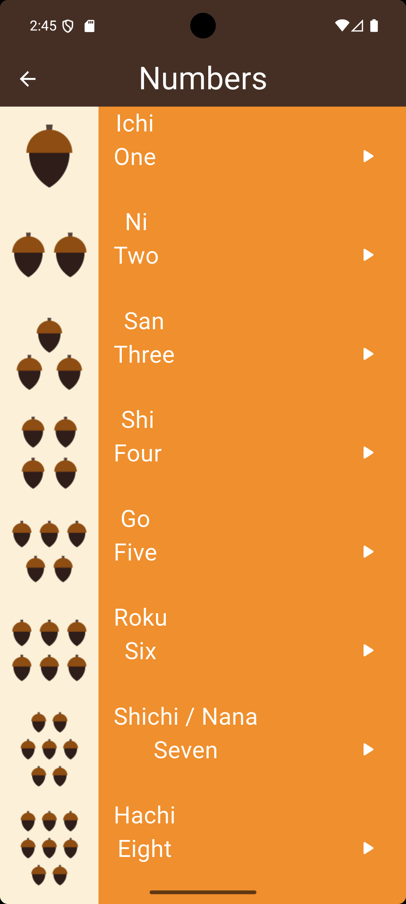
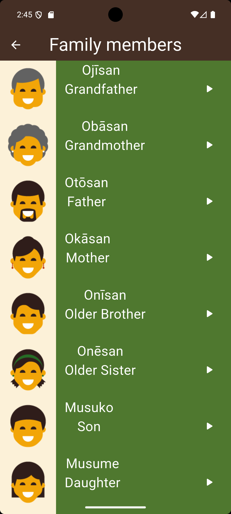
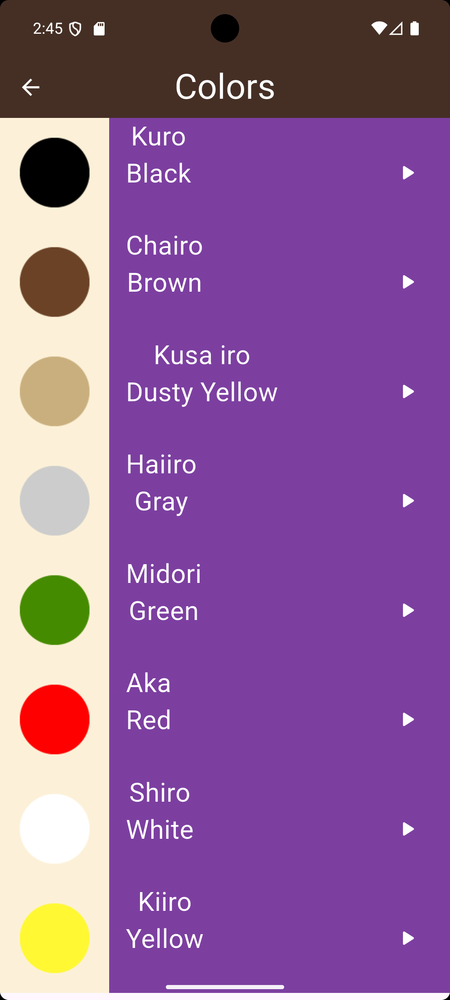
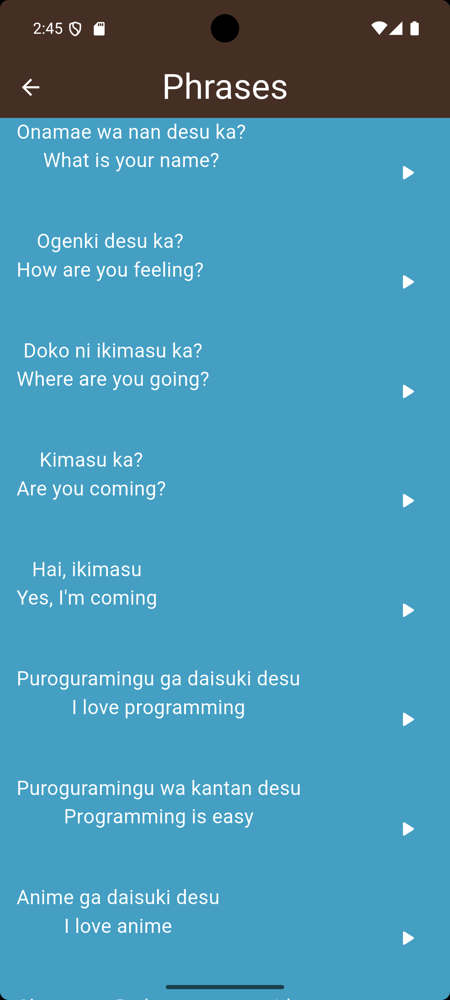

# 🇯🇵 Toku App

<p align="center">
  
</p>

<p align="center">
  A Flutter application that helps beginners learn Japanese vocabulary through images and native pronunciation.
</p>

<p align="center">
  
  
  
  
</p>

---

## 📖 About

Toku App is a beginner-friendly Japanese learning application built with Flutter. It organizes vocabulary into different categories, allowing users to learn words with corresponding images and native audio pronunciation.

The project was created to practice Flutter fundamentals such as navigation, reusable widgets, asset management, and clean project structure.

---

## ✨ Features

- 🔢 Learn Japanese Numbers
- 👨‍👩‍👧‍👦 Family Members Vocabulary
- 🎨 Colors Vocabulary
- 💬 Common Japanese Phrases
- 🔊 Native Audio Pronunciation
- 📱 Simple & Responsive UI
- ♻️ Reusable Widgets
- 📂 Organized Project Structure

---

## 📸 Screenshots

| Home | Numbers |
|------|---------|
|  |  |

| Family Members | Colors |
|------|---------|
|  |  |

| Phrases |
|------|
|  |

---

## 🛠️ Built With

- Flutter
- Dart
- Material Design
- flutter_soloud

---

## 📂 Project Structure

```text
lib/
│
├── components/
│   ├── building_item.dart
│   ├── building_phrase.dart
│   └── category_container.dart
│
├── models/
│   ├── category_model.dart
│   └── phrase_model.dart
│
├── pages/
│   ├── home_page.dart
│   ├── numbers_page.dart
│   ├── family_members_page.dart
│   ├── colors_page.dart
│   ├── phrases_page.dart
│   └── main.dart
│
assets/
├── images/
│   ├── colors/
│   ├── family_members/
│   └── numbers/
│
└── sounds/
    ├── colors/
    ├── family_members/
    ├── numbers/
    └── phrases/
```

---

## 🚀 Getting Started

Clone the repository:

```bash
git clone https://github.com/Muhammadkhiry/tuko_app.git
```

Navigate to the project folder:

```bash
cd tuko_app
```

Install dependencies:

```bash
flutter pub get
```

Run the application:

```bash
flutter run
```

---

## 🎯 What I Learned

During this project I practiced:

- Flutter Navigation
- Stateless Widgets
- Widget Composition
- Custom Reusable Components
- Assets Management
- Audio Playback
- Project Organization
- Clean UI Design

---

## 🔮 Future Improvements

- Add Dark Mode
- Favorite Words
- Search Functionality
- Quiz Mode
- Progress Tracking
- More Vocabulary Categories

---

## 👨‍💻 Author

**Muhammad Khiry**

GitHub: https://github.com/Muhammadkhiry

---

⭐ If you found this project helpful, don't forget to leave a star!